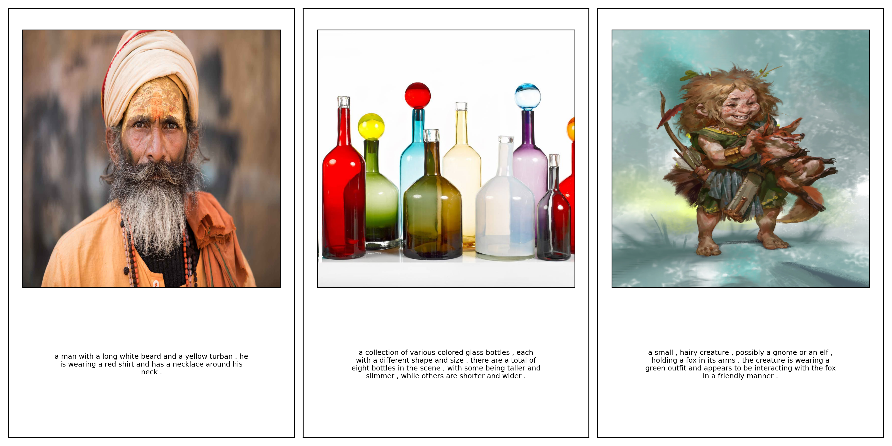

# Image Captioning

I started this project to learn about the Transformer architecture and code as much as possible from scratch with minimal external dependencies.
All of this could have been a week's work with frameworks like HF or pytorch lightning and pre-trained models, but took me about an hour every day for 2 months to finish. I really want to say that i am satisfied with the finally produced model but that desire is like chasing the last prime, never ends. Although in terms of prime i am like, around 3 with this model. But it did make me realise how enormously difficult it is to train generative models. The model can currently only generate a few words long generic caption given an image, which is obviously nowhere near good, but i will possibly improve it in future.

## Dataset
The Model is trained online on [RELAION-POP](https://huggingface.co/datasets/laion/relaion-pop) 600K dataset. The dataset is only url-caption pairs so the images have to be downloaded on the fly while training. Basic idea is to asynchronously and parallely download images in the background while training occurs to prevent GPU idling.I sliced the caption to only contain first 2 sentences since my decoder is not large enough to generate paragraphs. Look at `datasets/streaming_dataset.py` for the dataset implmentation. Samples:

Evaluation of model is done on Flickr30K image dataset as well.

## Architecture
The final model is a ResNet101 Encoder with ImageNet weights (42M) and a Transformer Decoder (60M). I wrote the transformer architecure from scratch since that was the initial purpose of this project. I also tried Tranformer Encoders and LSTM+Soft Attention architectures.

## Tokenizer
I implemented my own WordPiece Tokenizer class for learning purpose. Since RELAION-POP dataset would not be enough to train the vocabulary of tokenizer, i used pre-trained vocabulary from `bert-base-uncased` model on HF. Instead of using entire vocabluary i sampled top 15K words from it based on their frequencies in my caption corpus.

## Training
Training was done with the standard teacher forcing method using:
* Cross Entropy Loss added with EOS supression loss to minimize the probability of EOS token before 15 tokens (this is still a major issue with the model).
* Adam Optimizer with an inverse sqrt LR decay (LR = 1e-4)
* **Albumentations** was used to perform image augmentation with exponential ramp up as training progressed. Look at `/utils/augmentations.py` for specific augmentations.
* I rented a machine with **4x RTX 4090** GPUs with a total of **96GB** VRAM from [Vast.ai](https://www.vast.ai). Another important hardware aspect here was the high network bandwidth of the machine since the dataset was online. 
* I used Free tier Weights & Biases account for logging metrics of dataloaders, workers, network, GPU utilization, model parameters, gradients, loss functions values, learning rate values and image augmentation levels. I was truly humbled after realizing that this is the most crucial component of model training.
* Inference is done using beam search for beam size 5 and length normalization factor 0.6

## Results 

### on unseen RELAION-POP images

### on Flickr30K images

### on some of my own selected images

### Metrics on Flickr30K
* BLEU@4: **17.24%** 
* CIDEr@5: **64.27**

### Notes on further imoprovements for myself:
- Model still suffers from mode collapse, because 600K random image-caption pairs are not enough to teach generality to a 100M model, so it just predicts most common and obvoius patterns from the image-caption corpus.

- Ideal training would involve pre-training Vision Encoder and Language Decoder separately then together (like CLIP) on millions of image-text pairs to teach the model generality and then training using teacher forcing for proper image captioning

- But this would require signficantly more compute and time, so parking it for now. 